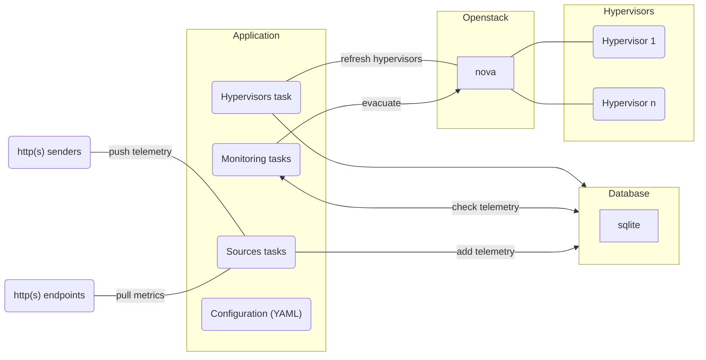

# Kubernetes Cluster 

The CobaltCore cluster is a Kubernetes-based environment designed to manage hypervisor nodes and their associated workloads. 
It provides a robust framework for deploying, scaling, and maintaining virtual machines across multiple hypervisor nodes.

The cluster is provisioned using [IronCore](https://ironcore.dev/), which automates the discovery, provisioning, and evacuation of hypervisor nodes.

Components of the cluster, which are not required to be run on every hypervisor node, are deployed as Kubernetes Deployments.

## Hypervisor Operator

::: tip Source Code
[github.com/cobaltcore-dev/openstack-hypervisor-operator](https://github.com/cobaltcore-dev/openstack-hypervisor-operator)
:::

The Kubernetes operator that manages the lifecycle of hypervisor nodes.
It ensures a newly discovered node is properly configured and integrated into the cluster.
After the initial onboarding, the operator runs a final check to ensure the node is ready for use.
The operator also handles the evacuation of nodes in case of failures or maintenance.

## HA Service

::: tip Source Code
[github.com/cobaltcore-dev/kvm-ha-service](https://github.com/cobaltcore-dev/kvm-ha-service)
:::

The **KVM High Availability Service** is a central component that monitors the health and status of hypervisor nodes and their virtual machines.
It collects telemetry data from the KVM HA Agent, processes it, and provides insights into the state of the hypervisors and their workloads.
It is responsible for ensuring that critical workloads remain operational even in the event of failures.

