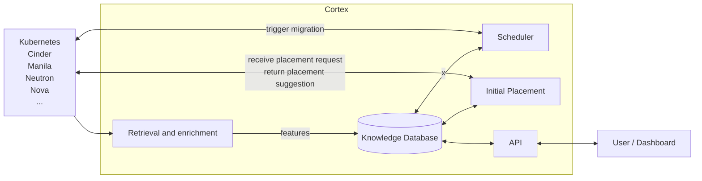

# Cortex

Cortex is a modular and extensible service for initial placement and scheduling in cloud-native environments covering workloads such as compute, storage, network, and other scheduling domains.  
It improves resource utilization and operational performance by making smart placement decisions based on the current state of the environment and defined constraints and objectives.

## Features

- **Modular and versatile design**: Cortex consists of a minimal core framework that can be extended with various plugins to support different data sources and scheduling algorithms. This provides flexibility in adapting to various cloud environments and requirements.
- **Centralized knowledge database**: Cortex provides a holistic knowledge database that stores enriched data from various sources, enabling efficient retrieval and processing of information for scheduling decisions.
- **Unified placement and scheduling**: Cortex combines initial placement and continuous scheduling into a single service.
- **Cross-domain support**: Cortex supports a wide range of workloads from various scheduling domains, including compute, storage, and network. The architecture allows handling the domains independently or in a unified manner.
- **Performance and scalability**: Cortex is designed to minimize the resource footprint and maximize its performance using alghorithmic and heuristic approaches. It is battle-tested in large-scale, produciton environmments.

## High-level Architecture

This section presents the conceptual workflow on a high-level.

