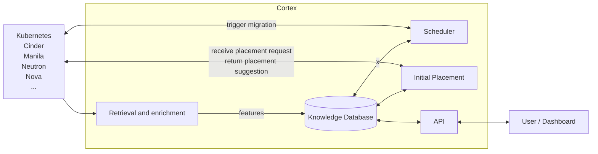

# Cortex

Cortex is a modular and extensible service for initial placement and scheduling in cloud-native environments covering workloads such as compute, storage, network, and other scheduling domains.  
It improves resource utilization and operational performance by making smart placement decisions based on the current state of the environment and defined constraints and objectives.

Please find the full documentation in the [Cortex repository](https://github.com/cobaltcore-dev/cortex).

## Features

- **Modular and extensible design**  
  Cortex consists of a minimal core framework that can be extended with various plugins to support different data sources and scheduling algorithms. 
  This provides flexibility and enables adapting Cortex to various environments and requirements.

- **Centralized knowledge database**
  Cortex provides a holistic knowledge database that stores enriched data from various sources.
  This enables efficient and consistent access to the infrastructure state for placement and scheduling decisions.

- **Integrated placement and scheduling**  
  Cortex combines initial placement and continuous scheduling into a single service.

- **Cross-domain support**  
  Cortex supports a wide range of workloads from various scheduling domains, including compute, storage, and network. 
  The architecture allows handling the domains either independently or through coordinated multi-domain decisions.

- **Performance and scalability**
  Cortex is designed for production-scale deployments using algorithmic and heuristic approaches to balance decision quality and execution efficiency.
  It is battle-tested in large-scale, production cloud computing environments and can handle thousands of placement requests per second.

## High-level Architecture

This section presents the conceptual workflow on a high-level.

Conceptually, Cortex consists of 
- a **retrieval and enrichment** component that collects and processes data from various sources,
- a **knowledge database** that stores the enriched data,
- an **initial placement** component that uses the knowledge database to make initial placement decisions for new workloads,
- a **scheduler** that makes placement decisions based on the data in the knowledge database,
- an **API** that provides access to the knowledge database and the scheduler.

