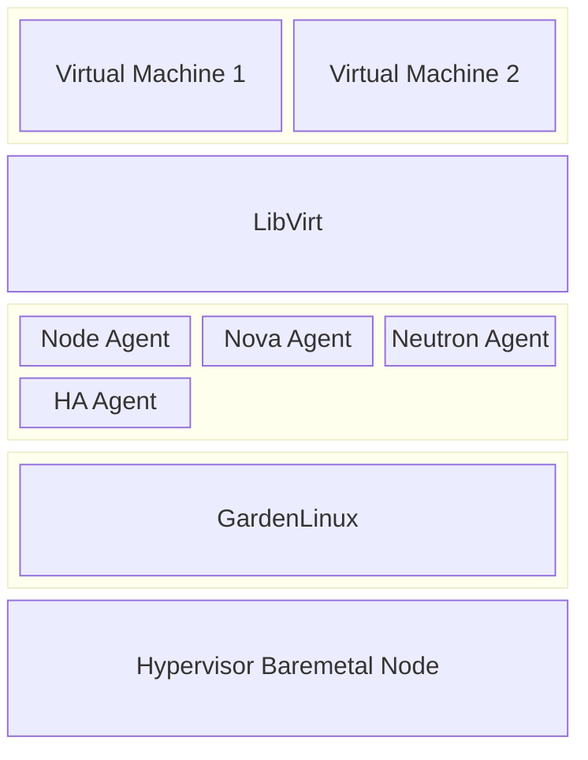
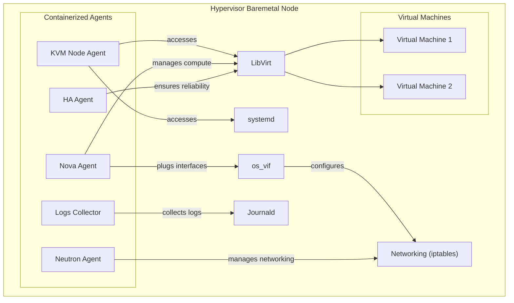
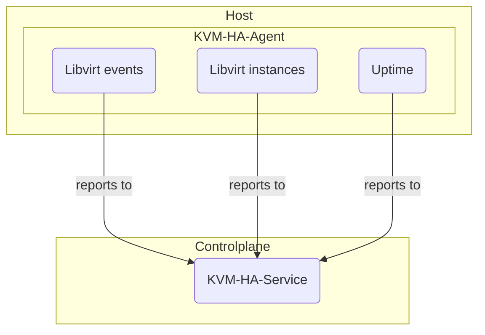

# Hypervisor
The hypervisor is the foundation of the CobaltCore architecture, providing the virtualization layer that allows multiple virtual machines to run on a single physical server.

[[toc]]

## Components of the Hypervisor



Components of the hypervisor include:

- [**KVM Node Agent**](#kvm-node-agent): Responsible for managing the node lifecycle and integration with the Kubernetes cluster.
- **Nova Agent**: Handles the compute services, including scheduling and resource allocation for virtual machines.
- **Neutron Agent**: Manages networking services, providing connectivity between virtual machines and external networks.
- **HA Agent**: Ensures high availability of critical workloads by monitoring and managing failover processes.
- **GardenLinux**: The Linux based operating system that runs on the hypervisor, providing a lightweight and secure environment for virtual machines.

## Interactions and Dependencies

CobaltCore's hypervisor components interact with each other and with the underlying system. 
Communication is facilitated through various APIs and services, usally via Unix domain sockets or TCP based protocols. 
Key system components include:

- **LibVirt**: The virtualization API that allows the Node Agent and Nova Agent to manage virtual machines.
- **Linux Networking**: Manages network traffic and security rules for virtual machines. Also provides connectivity between virtual machines and external networks.
- **os_vif**: A library that provides virtual interface management for OpenStack, allowing the Nova Agent to plug interfaces into the networking stack.
- **systemd**: The init system that manages services and processes on the hypervisor node.
- **Journald**: The logging system that collects and manages logs from various components of the hypervisor. Part of the systemd suite.



## KVM HA Agent
::: tip Source Code
[github.com/cobaltcore-dev/kvm-ha-agent](https://github.com/cobaltcore-dev/kvm-ha-agent)
:::

The **KVM High Availability Agent (kvm-ha-agent)** is a lightweight Go-based application designed to monitor and report the state of KVM hypervisors and their virtual machines. It integrates with libvirt to capture events, instances and system uptime, sending telemetry data to a central high-availability [service](https://github.com/cobaltcore-dev/kvm-ha-service) for further processing.

### Features

- **Libvirt Event Monitoring**:
  - Subscribes to various libvirt domain events:
    - Lifecycle changes
    - Reboots
    - Watchdog triggers
    - I/O errors
    - Control Errors
    - Agent lifecycle
    - Memory failures
  - Monitoring and reporting can be configured via `ConfigMap`.
- **Uptime Reporting**: Periodically reports the system uptime of the host.
- **Instances Reporting**: Periodically reports the instances that exists on the hypervisor.

### Overview



## KVM Node Agent

::: tip Source Code
[github.com/cobaltcore-dev/kvm-node-agent](https://github.com/cobaltcore-dev/kvm-node-agent)
:::

The **KVM Node Agent** is a lightweight Go-based application that runs on each hypervisor node. 
It is responsible for managing the lifecycle of the node and its integration with the Kubernetes cluster. 
The agent ensures that the node is properly configured and ready for use, 
and exposes information about the libvirt hypervisor to the Kubernetes API.

It provides following Custom Resource Definitions (CRDs):

- **hypervisors.kvm.cloud.sap**: 
  - Represents a hypervisor node in the Kubernetes cluster.
  - Contains metadata about the node, such as its name, status, and configuration.
  - GardenLinux version, kernel version, and other relevant details.
  - Hardware model, CPU and memory information, and other relevant details.
  - List of running virtual machines on the hypervisor.
  - Status of hypervisor related systemd services.

Example CRD:

```shell
$ kubectl get hypervisors.kvm.cloud.sap
NAME            NODE            VERSION               INSTANCES   HARDWARE               KERNEL          AGE
node001-bb234   node001-bb234   Garden Linux 1933.0   11          PowerEdge R860         6.12.38-amd64   4d8h
node006-bb123   node006-bb123   Garden Linux 1933.0   0           ProLiant DL560 Gen11   6.12.38-amd64   27h
```

- **migrations.kvm.cloud.sap**: 
  - Represents a migration operation for a virtual machine.
  - Contains metadata about the migration, such as the source and destination hypervisors, status, and progress.
  - Used to track the progress of migrations and ensure that they are completed successfully.

Example CRD:
```shell
$ kubectl get migrations.kvm.cloud.sap
NAME                                   ORIGIN          DESTINATION     TYPE        OPERATION       STARTED   ELAPSED     DATA TOTAL   DATA PROCESSED   DATA REMAINING   MEMORY TX      MEMORY DIRTY RATE   MEMORY ITERATION
12e479eb-6bef-4fdb-bfdc-0388df68bed9   node002-bb086   node008-bb086   completed   migration_in    74d       2.755s      4.0 GiB      10.4 MiB         0 B              16.5 MiB/s     0/s                 3
13679335-291c-4405-9e08-5911032599dd   node007-bb086   node009-bb086   completed   migration_out   78d       2.766s      4.0 GiB      398.0 MiB        718.8 MiB        588.9 MiB/s    0/s                 1
1552e60a-bdba-4850-84da-07dd635bce2c   node006-bb086   node003-bb087   completed   migration_out   22d       35.078s     64.0 GiB     58.4 GiB         0 B              1.8 GiB/s      1250/s              4
```