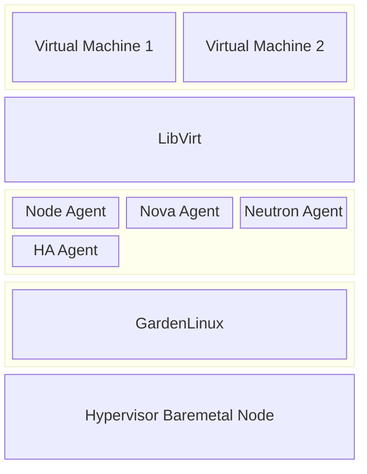
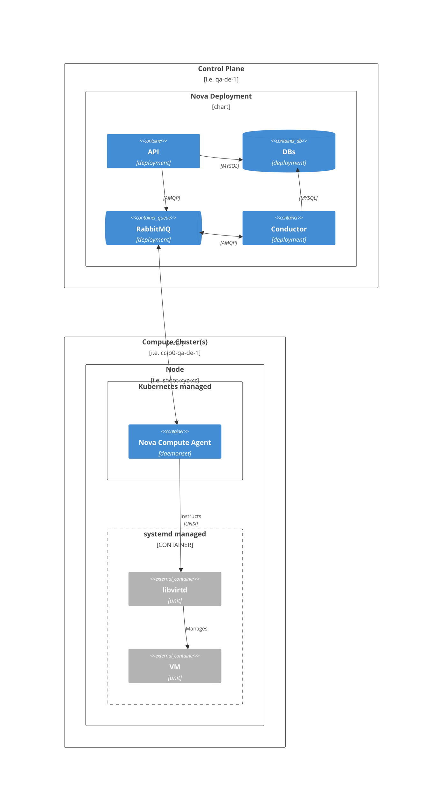
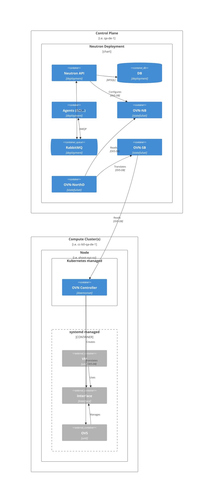
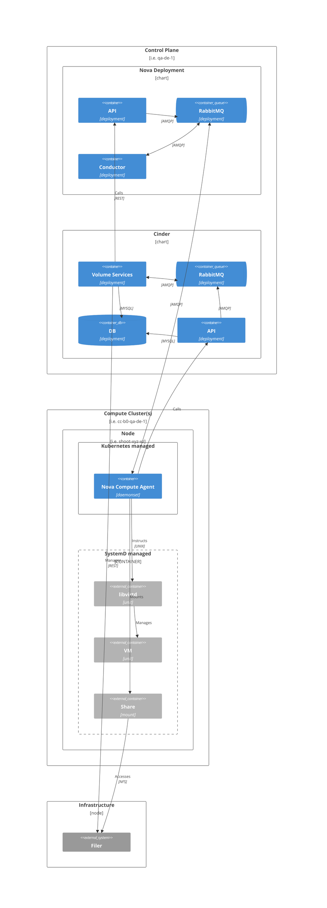

<!-- 
SPDX-FileCopyrightText: SAP SE or an SAP affiliate company
SPDX-License-Identifier: Apache-2.0
-->
---
outline: deep
---

# Architecture

CobaltCore is built on top of OpenStack and IronCore, leveraging their capabilities to provide a robust cloud-native environment for non-cloud-native workloads. The architecture consists of several key components that work together to deliver a seamless experience.

- **Kubernetes**: The container orchestration platform that manages the deployment, scaling, and operation of containerized applications.
- **IronCore**: Bare metal provisioning and management tool that automates the discovery, provisioning, and evacuation of servers in the CobaltCore environment.
- **OpenStack**: The various OpenStack services that provide compute, storage, and networking capabilities to the CobaltCore environment.
- **Greenhouse**: The monitoring and management tool that provides insights into the health and performance of the CobaltCore environment.
- **HA Service**: The high availability service that ensures critical workloads remain operational even in the event of failures.
- **Cortex**: Smart placement service for VMs and storage in an OpenStack cloud environment.

## Hypervisor
The hypervisor is the foundation of the CobaltCore architecture, providing the virtualization layer that allows multiple virtual machines to run on a single physical server.
Components of the hypervisor include:
- **Node Agent**: Responsible for managing the node lifecycle and integration with the Kubernetes cluster.
- **Nova Agent**: Handles the compute services, including scheduling and resource allocation for virtual machines.
- **Neutron Agent**: Manages networking services, providing connectivity between virtual machines and external networks.
- **HA Agent**: Ensures high availability of critical workloads by monitoring and managing failover processes.
- **GardenLinux**: The Linux based operating system that runs on the hypervisor, providing a lightweight and secure environment for virtual machines.

**Architecture:**

## Cluster Components
The cluster components are responsible for managing the overall CobaltCore environment, including orchestration, monitoring, and management of resources.
Components of the cluster include:

**Hypervisor Operator**: 
The Kubernetes operator that manages the lifecycle of hypervisor nodes.
It ensures a newly discovered node is properly configured and integrated into the cluster.
After the initial onboarding, the operator runs a final check to ensure the node is ready for use.
The operator also handles the evacuation of nodes in case of failures or maintenance.

## OpenStack
OpenStack is a collection of services that provide compute, storage, and networking capabilities to the CobaltCore environment. The architecture of OpenStack in CobaltCore consists of several key components:

This is a simplified model, leaving out [cells](https://docs.openstack.org/nova/latest/admin/cells.html).

### Compute

### Networking

This section describes the networking components of OpenStack in CobaltCore, focusing on the Neutron service and its integration with OVN (Open Virtual Network).

- Further reading
  - [OVN Architecture](https://www.ovn.org/en/architecture/)
  - Redhat Documentation on [Open Virtual Network (OVN)](https://docs.redhat.com/en/documentation/red_hat_openstack_platform/13/html/networking_with_open_virtual_network/open_virtual_network_ovn)

### Storage

