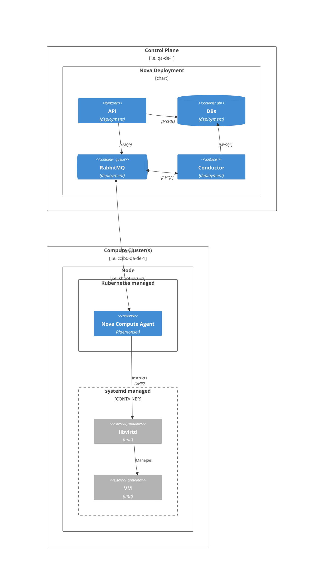
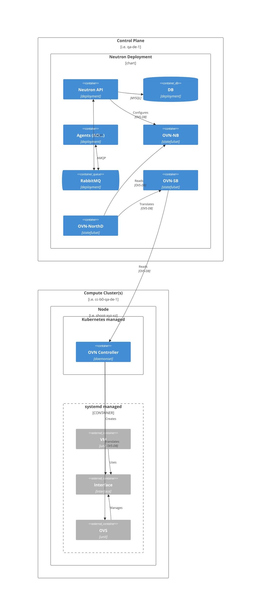
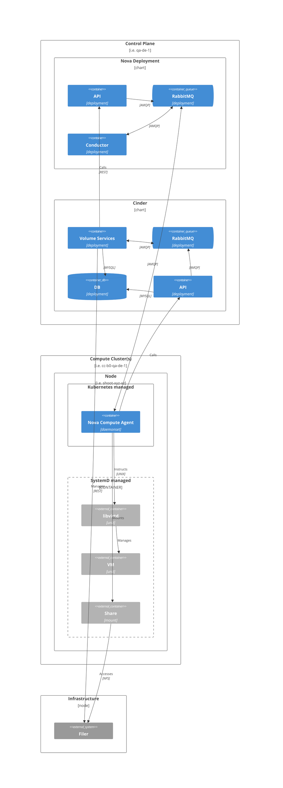

# OpenStack
OpenStack is a collection of services that provide compute, storage, and networking capabilities to the CobaltCore environment.
It is designed to be modular and extensible, allowing for the integration of various components to meet specific requirements. 
In CobaltCore, OpenStack is deployed using Helm charts, which simplifies the installation and management of OpenStack services.

### OpenStack Architecture in CobaltCore

The architecture of OpenStack in CobaltCore consists of several key components:

This is a simplified model, leaving out [cells](https://docs.openstack.org/nova/latest/admin/cells.html).

## Compute

## Networking

This section describes the networking components of OpenStack in CobaltCore, focusing on the Neutron service and its integration with OVN (Open Virtual Network).

- Further reading
  - [OVN Architecture](https://www.ovn.org/en/architecture/)
  - Redhat Documentation on [Open Virtual Network (OVN)](https://docs.redhat.com/en/documentation/red_hat_openstack_platform/13/html/networking_with_open_virtual_network/open_virtual_network_ovn)

## Storage

