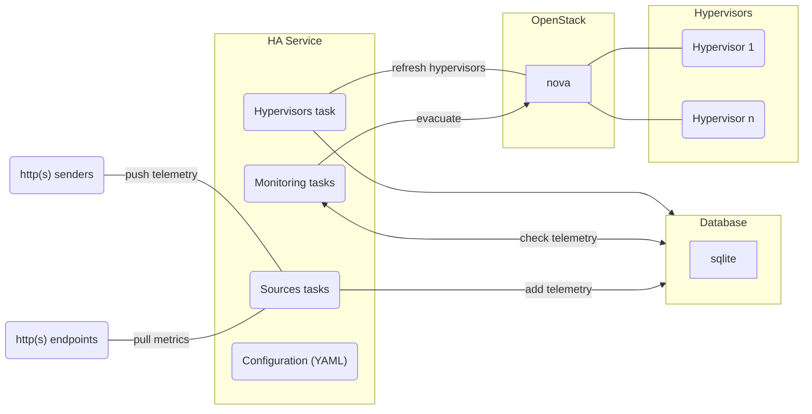

# HA Service

::: tip Source Code
[github.com/cobaltcore-dev/kvm-ha-service](https://github.com/cobaltcore-dev/kvm-ha-service)
:::

The KVM High Availability Service monitors hypervisor health across the cluster and triggers VM evacuation when a node fails or becomes unresponsive. It is the central component that makes CobaltCore's compute layer resilient to hardware failures.

## How it works

Each hypervisor runs the [KVM HA Agent](/compute/hypervisor#kvm-ha-agent), which pushes telemetry (libvirt events, instance state, uptime) to the HA Service. The HA Service processes this data, tracks hypervisor health over time, and calls Nova's evacuation API when a node is determined to be unhealthy.

## Internal tasks

| Task | Role |
|---|---|
| **Sources** | Collects telemetry from HA Agents (pull via HTTP endpoints or push via HTTP senders) |
| **Monitoring** | Evaluates telemetry against thresholds; triggers Nova evacuation when a hypervisor is unhealthy |
| **Hypervisors** | Keeps the local hypervisor inventory in sync with Nova |

## Evacuation flow

1. HA Agent on a hypervisor node stops sending heartbeats (node unreachable or crashed)
2. Monitoring task detects the gap exceeds the configured threshold
3. HA Service calls Nova's host evacuation API for the affected hypervisor
4. Nova reschedules VMs from the failed node to healthy hypervisors
5. Hypervisors task marks the evacuated node as disabled in Nova

## See also

- [API Reference — Eviction](/api/kvm.cloud.sap/v1/eviction)
- [Compute — Hypervisor](/compute/hypervisor)
