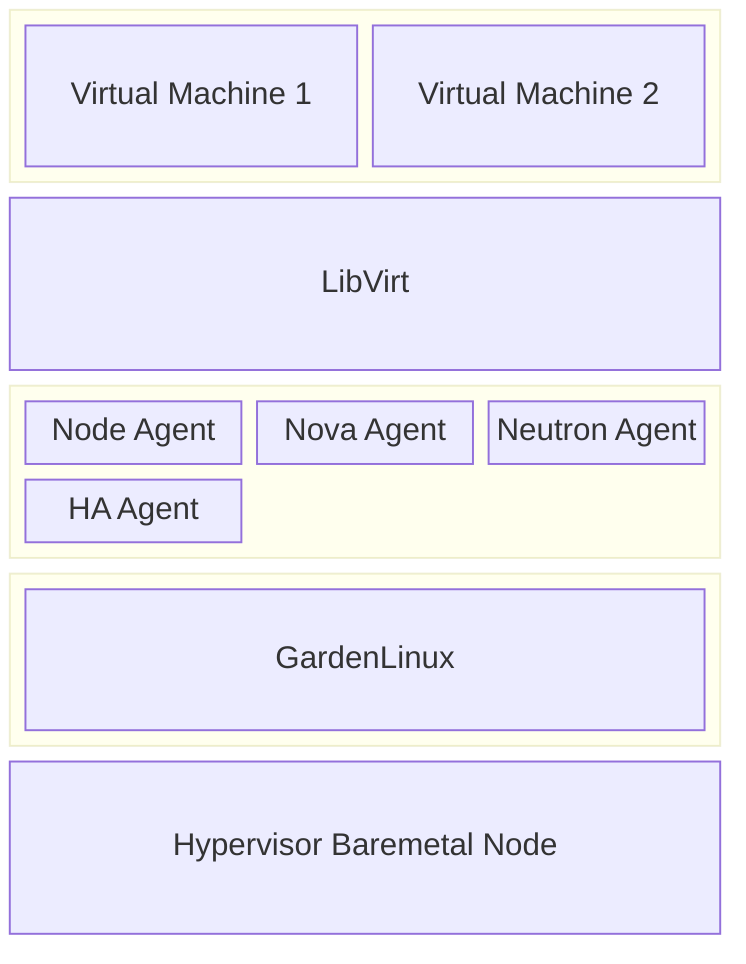
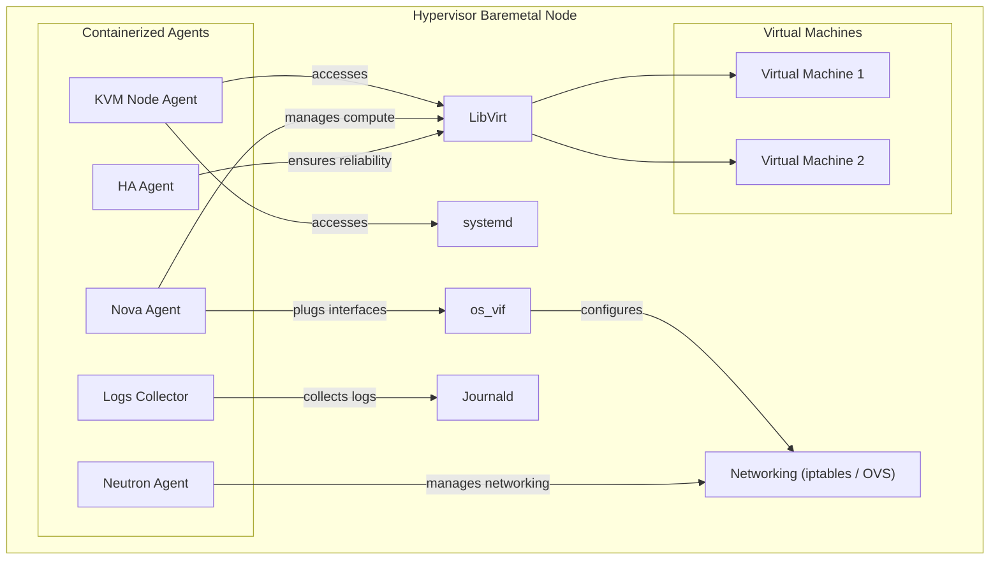
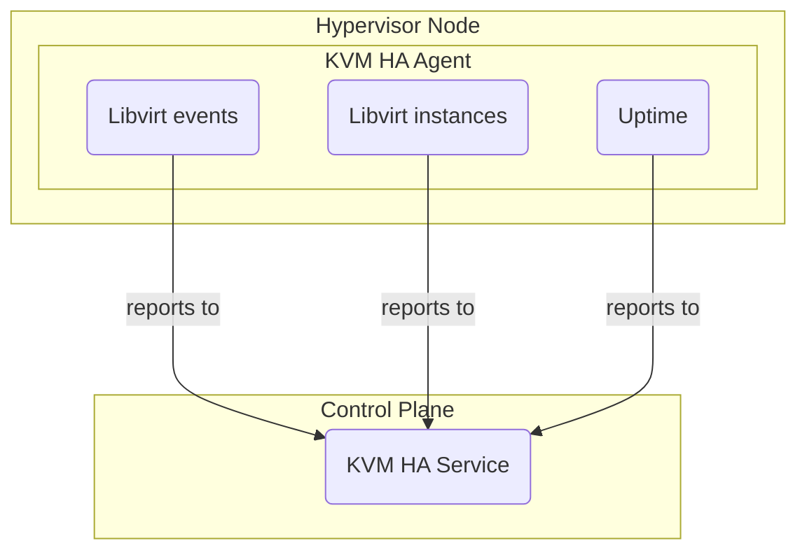

# Hypervisor

::: tip Source Code
[github.com/cobaltcore-dev/openstack-hypervisor-operator](https://github.com/cobaltcore-dev/openstack-hypervisor-operator)
:::

The hypervisor is the bare metal node that runs virtual machines. CobaltCore manages hypervisors through a set of Kubernetes operators and containerized agents that handle configuration, health reporting, and VM lifecycle — without requiring direct access to the node.

## Component stack

Each hypervisor node runs the following components on top of [GardenLinux](/platform/gardenlinux):



| Agent | Role |
|---|---|
| **Node Agent** | Manages node lifecycle and exposes hardware state to Kubernetes |
| **Nova Agent** | Handles compute scheduling and VM creation via libvirt |
| **Neutron Agent** | Manages VM network interfaces via OVN/OVS |
| **HA Agent** | Monitors libvirt events and reports telemetry to the HA Service |

## Interactions

Components communicate through Unix domain sockets or TCP. Key system dependencies:



## KVM Node Agent

::: tip Source Code
[github.com/cobaltcore-dev/kvm-node-agent](https://github.com/cobaltcore-dev/kvm-node-agent)
:::

The Node Agent runs on each hypervisor and exposes the node's hardware state and VM inventory to the Kubernetes API through two CRDs:

### `hypervisors.kvm.cloud.sap`

Represents a hypervisor node. Tracks hardware model, CPU/memory topology, GardenLinux version, running VMs, and systemd service status.

```shell
$ kubectl get hypervisors.kvm.cloud.sap
NAME            NODE            VERSION               INSTANCES   HARDWARE               KERNEL          AGE
node001-bb234   node001-bb234   Garden Linux 1933.0   11          PowerEdge R860         6.12.38-amd64   4d8h
node006-bb123   node006-bb123   Garden Linux 1933.0   0           ProLiant DL560 Gen11   6.12.38-amd64   27h
```

See the [API Reference](/api/kvm.cloud.sap/v1/hypervisor) for the full spec.

### `migrations.kvm.cloud.sap`

Tracks live migration operations between hypervisors — source, destination, progress (data transferred, memory iteration, elapsed time).

```shell
$ kubectl get migrations.kvm.cloud.sap
NAME                                   ORIGIN          DESTINATION     TYPE        OPERATION       STARTED   ELAPSED     DATA TOTAL
12e479eb-6bef-4fdb-bfdc-0388df68bed9   node002-bb086   node008-bb086   completed   migration_in    74d       2.755s      4.0 GiB
1552e60a-bdba-4850-84da-07dd635bce2c   node006-bb086   node003-bb087   completed   migration_out   22d       35.078s     64.0 GiB
```

See the [API Reference](/api/kvm.cloud.sap/v1alpha1/migration) for the full spec.

## KVM HA Agent

::: tip Source Code
[github.com/cobaltcore-dev/kvm-ha-agent](https://github.com/cobaltcore-dev/kvm-ha-agent)
:::

The HA Agent subscribes to libvirt domain events and periodically reports instance state and host uptime to the central [HA Service](/compute/ha-service). The HA Service uses this telemetry to detect unhealthy nodes and trigger evacuation.



Monitored libvirt events include: lifecycle changes, reboots, watchdog triggers, I/O errors, control errors, agent lifecycle, and memory failures.
