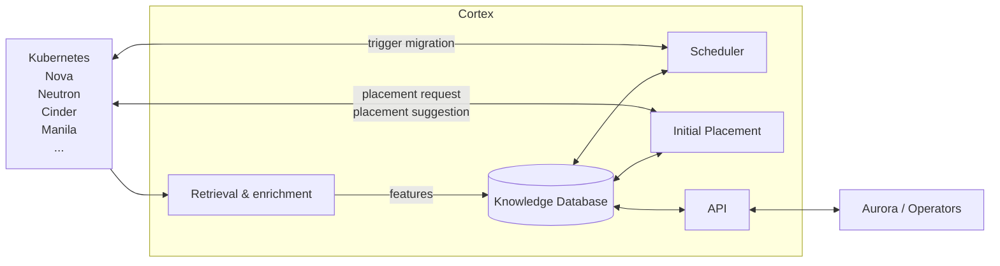

# Cortex

::: tip Source Code
[github.com/cobaltcore-dev/cortex](https://github.com/cobaltcore-dev/cortex)
:::

Cortex is CobaltCore's intelligent placement and scheduling engine. It collects real-time state from across the infrastructure, maintains a knowledge database of cluster conditions, and uses that data to make smarter placement decisions for compute, storage, and network workloads.

## What it solves

Nova's default scheduler makes placement decisions based on static filters and weights. Cortex enriches those decisions with live data — current hypervisor load, VM distribution patterns, storage latency, network topology — to optimize for resource utilization and workload performance.

## Architecture

## Components

| Component | Role |
|---|---|
| **Retrieval & Enrichment** | Collects and processes data from Kubernetes, Nova, Neutron, Cinder, and other sources |
| **Knowledge Database** | Central store of enriched infrastructure state — the basis for all placement decisions |
| **Initial Placement** | Handles placement requests for new workloads; returns a placement suggestion to the caller |
| **Scheduler** | Continuously monitors running workloads and triggers migrations when conditions change |
| **API** | Exposes the knowledge database and placement engine to Aurora and operators |

## Key features

- **Modular plugins** — data sources and scheduling algorithms are pluggable; Cortex adapts to different environments
- **Cross-domain** — handles compute, storage, and network placement independently or as coordinated decisions
- **Production-scale** — designed for thousands of placement requests per second in large cloud deployments

## See also

- [Cortex full documentation](https://github.com/cobaltcore-dev/cortex)
- [Management — Aurora](./aurora) — UI that surfaces Cortex placement recommendations
- [OpenStack — Nova](../openstack/nova) — Nova placement API that Cortex integrates with
