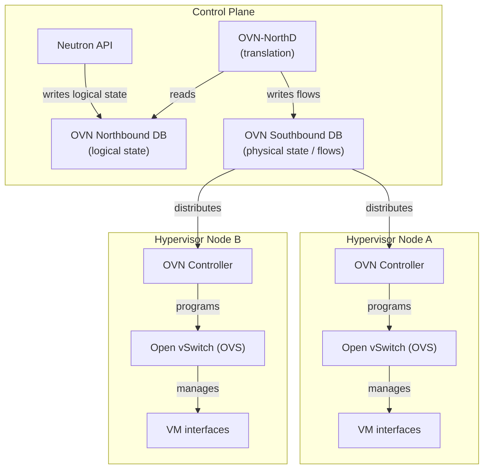

# OVN (Open Virtual Network)

OVN is the virtual networking backend for CobaltCore. It replaces the traditional per-node Neutron Open vSwitch agents with a centralized control plane and distributed forwarding, giving consistent network state across all hypervisor nodes.

## Architecture

## Data flow

| Component | Role |
|---|---|
| **Neutron API** | Writes logical network resources (networks, ports, routers, security groups) to OVN Northbound DB via the OVN ML2 driver |
| **OVN Northbound DB** | Stores the logical network model — what the network should look like |
| **OVN-NorthD** | Translates the logical model into forwarding rules and populates OVN Southbound DB |
| **OVN Southbound DB** | Stores the physical network state — which hypervisor hosts which port, and what flows to install |
| **OVN Controller** | Runs as a daemonset on each hypervisor; reads its local flows from OVN-SB and programs OVS |
| **OVS** | Kernel-level datapath that forwards VM traffic according to the flows installed by OVN Controller |

## Why OVN over Neutron's legacy agents?

With traditional OVS agents, each hypervisor node runs its own Neutron agent that independently manages network state. At scale this creates coordination complexity, slow convergence, and debugging difficulty. OVN centralizes the control plane:

- Network state is authoritative in OVN-NB — no drift between nodes
- Adding a hypervisor node requires no per-node Neutron agent configuration
- Troubleshooting uses OVN-trace to follow a packet's path through logical flows

## See also

- [OpenStack — Neutron](/openstack/neutron)
- [OVN architecture overview](https://www.ovn.org/en/architecture/)
- [Red Hat OVN guide](https://docs.redhat.com/en/documentation/red_hat_openstack_platform/13/html/networking_with_open_virtual_network/open_virtual_network_ovn)
