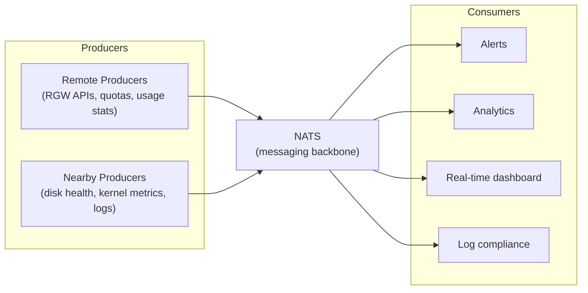

# Prysm

::: tip Source Code
[github.com/cobaltcore-dev/prysm](https://github.com/cobaltcore-dev/prysm)
:::

Prysm is CobaltCore's observability tool for Ceph storage clusters and RADOS Gateway deployments. It provides real-time monitoring, SMART disk health checks, and log compliance analysis - either as a standalone CLI or as part of the metrics pipeline feeding Prometheus.

## Architecture

Prysm uses a four-tier architecture to collect and process observability data:

| Tier | Role |
|---|---|
| **Remote Producers** | Collect data from outside the Ceph cluster - RGW bucket notifications, quota usage, RadosGW statistics |
| **Nearby Producers** | Operate within the cluster's network - disk health (SMART), kernel metrics, Ceph logs |
| **NATS** | Low-latency messaging backbone routing data between producers and consumers |
| **Consumers** | Process data for alerts, analytics, real-time dashboards, and log audit |

## Output formats

Prysm supports three output modes:

- **Console** - human-readable output for interactive use
- **NATS** - publishes metrics to the NATS cluster for downstream consumers
- **Prometheus** - exposes a `/metrics` endpoint that Prometheus can scrape

## Use cases

- Check Ceph cluster health and OSD SMART attributes across all disks
- Monitor RGW request rates, errors, and per-bucket usage in real time
- Audit log compliance - verify that access logs meet regulatory requirements
- Standalone Prometheus exporter for storage metrics not covered by the Ceph exporter

## See also

- [Observability - Prometheus](./prometheus)
- [Storage - Ceph](../storage/ceph)
