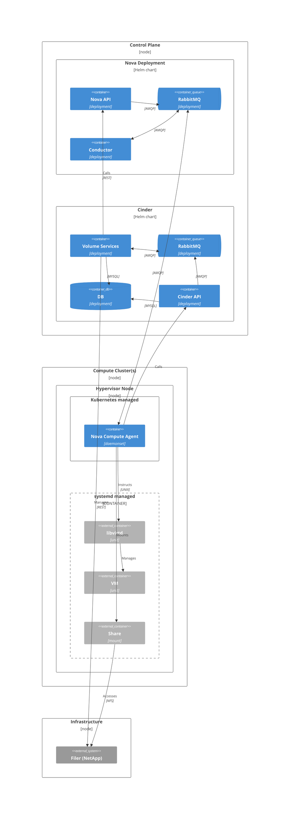

# Cinder (Block Storage)

Cinder is the OpenStack block storage service. It manages volume lifecycle — creation, attachment, snapshots, and deletion — and connects VMs to persistent storage backends.

## Architecture

## Storage backend

In CobaltCore's reference configuration, Cinder uses a **NetApp filer** as the storage backend. Volumes are delivered as NFS mounts to compute nodes. The Cinder Volume Service manages volume lifecycle via the NetApp REST API.

For environments without a NetApp filer, Ceph RBD is a supported alternative backend — volumes are attached directly to VMs using the `librbd` driver.

## See also

- [Storage — Ceph](/storage/ceph) (for RBD backend)
- [OpenStack Cinder docs](https://docs.openstack.org/cinder/latest/)
