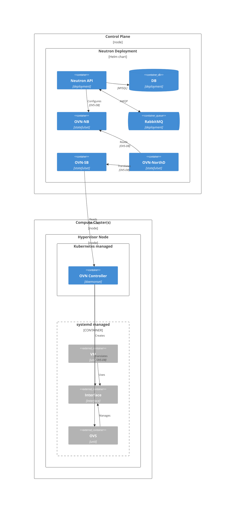

# Neutron (Networking)

Neutron is the OpenStack networking service. In CobaltCore, Neutron uses OVN (Open Virtual Network) as its backend, providing virtual networks, ports, routers, and security groups for VMs.

## Architecture

## OVN data plane

OVN replaces Neutron's traditional agent-per-node model:

| Component | Role |
|---|---|
| **OVN-NB (Northbound DB)** | High-level logical network state written by Neutron API |
| **OVN-NorthD** | Translates logical network state into low-level flow rules in OVN-SB |
| **OVN-SB (Southbound DB)** | Physical network state and flow rules consumed by OVN Controllers |
| **OVN Controller** | Runs on each compute node; translates SB flows into OVS rules |
| **OVS** | Open vSwitch — the kernel datapath that forwards VM traffic |

See [Networking — OVN](/networking/ovn) for the full OVN architecture and CobaltCore-specific configuration.

## See also

- [Networking — OVN](/networking/ovn)
- [OpenStack Neutron docs](https://docs.openstack.org/neutron/latest/)
- [OVN architecture overview](https://www.ovn.org/en/architecture/)
