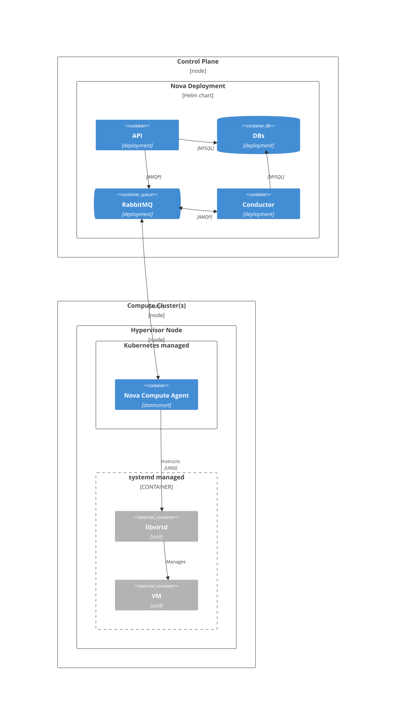

# Nova (Compute)

Nova is the OpenStack compute service. It handles VM lifecycle - scheduling, spawning, live migration, and evacuation - across the hypervisor nodes.

## Architecture

## Components

| Component | Role |
|---|---|
| **Nova API** | REST API for VM operations; accepts requests from users and Cinder |
| **Nova Conductor** | Mediates database access from compute agents; handles complex workflows like live migration |
| **Nova Compute Agent** | Runs on each hypervisor node as a daemonset; instructs libvirtd to create/delete/migrate VMs |
| **RabbitMQ** | Async messaging between API, Conductor, and Compute Agents |

## Integration with CobaltCore compute

Nova Compute Agents run as Kubernetes daemonsets on hypervisor nodes managed by the [Hypervisor Operator](/compute/hypervisor). When the Hypervisor Operator registers a new node, it also registers the node's compute capacity with Nova.

The [HA Service](/compute/ha-service) calls Nova's host evacuation API when a hypervisor fails.

[Cortex](/management/cortex) integrates with Nova's placement API to make intelligent scheduling decisions based on cluster state.

## See also

- [Compute - Hypervisor](/compute/hypervisor)
- [Compute - HA Service](/compute/ha-service)
- [OpenStack Nova docs](https://docs.openstack.org/nova/latest/)
