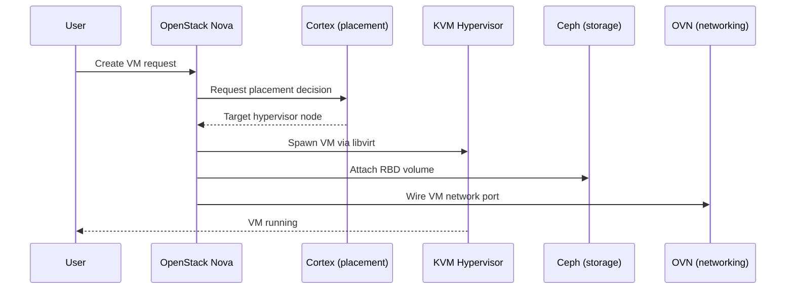

# Architecture

CobaltCore is organized as a layered stack. Each layer has a clear responsibility and depends only on the layers beneath it.

```
┌──────────────────────────────────────────────────────────┐
│  Management       Aurora · Greenhouse · Cortex           │
├──────────────────────────────────────────────────────────┤
│  OpenStack        Nova · Neutron · Cinder · Keystone     │
│                   Glance                                  │
├──────────────────────────────────────────────────────────┤
│  Compute          KVM Hypervisor · HA Service · GPU      │
│  Storage          Ceph · Rook · Arbiter · Chorus         │
│  Networking       OVN                                    │
├──────────────────────────────────────────────────────────┤
│  Observability    Prysm · Prometheus · Perses            │
├──────────────────────────────────────────────────────────┤
│  Platform         Kubernetes · Gardener · IronCore       │
│                   GardenLinux                            │
└──────────────────────────────────────────────────────────┘
```

## Platform

The foundation. Kubernetes provides the control plane. [IronCore](/platform/ironcore) handles bare metal discovery and lifecycle. [Gardener](/platform/gardener) manages cluster lifecycle (creating, upgrading, and deleting Kubernetes clusters). [GardenLinux](/platform/gardenlinux) is the hardened Linux OS that runs on hypervisor nodes.

Everything above this layer runs as Kubernetes workloads.

## Compute, Storage, Networking

The infrastructure data plane - the raw execution environment for virtual machines and cloud services.

- **[Compute](/compute/)** - KVM hypervisors managed by a Kubernetes operator. VMs run on bare metal nodes via libvirt. The HA service monitors hypervisor health and triggers evacuation when nodes fail.
- **[Storage](/storage/)** - Ceph provides block (RBD), object (RGW), and file (CephFS) storage. Rook operates Ceph as a Kubernetes-native workload. Arbiter enables stretched clusters across two data centers. Chorus handles S3 object replication.
- **[Networking](/networking/)** - OVN provides virtual networking for VMs. Neutron's OVN integration manages the control plane.

## Observability

Cross-cutting. [Prysm](/observability/prysm) collects audit and operational events. [Prometheus](/observability/prometheus) scrapes metrics from all layers. [Perses](/observability/perses) provides dashboards.

## OpenStack

The cloud services layer. OpenStack APIs (Nova, Neutron, Cinder, Keystone, Glance) are deployed via Helm and connect to the compute, storage, and networking layers below. Users and applications interact with CobaltCore primarily through OpenStack APIs.

## Management

The operations and control plane UI. [Aurora](/management/aurora) is the cloud management frontend. [Greenhouse](/management/greenhouse) provides the monitoring and management umbrella. [Cortex](/management/cortex) handles intelligent placement and scheduling of workloads across the cluster.

## Data flow: provisioning a VM

To ground the architecture, here is the path a VM takes from API call to running workload:


