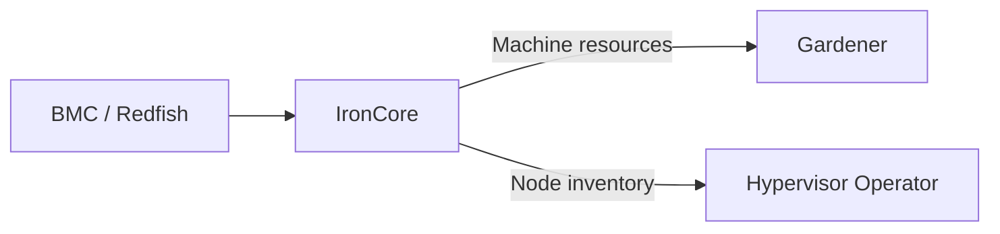

# IronCore

[IronCore](https://ironcore.dev) is the bare metal lifecycle management layer for CobaltCore. It discovers physical servers, manages their provisioning, and exposes them as Kubernetes resources that higher layers (Gardener, the Hypervisor Operator) can consume.

## What IronCore does

- Discovers servers via BMC interfaces (IPMI, Redfish)
- Collects hardware inventory: CPU topology, memory, NICs, disks
- Manages server power state and OS installation
- Exposes servers as `Machine` and `MachinePool` resources in Kubernetes
- Integrates with Gardener to provision cluster nodes

## How it fits in CobaltCore

IronCore sits at the base of the platform layer. Gardener requests machines from IronCore when creating or scaling a Shoot cluster. The Hypervisor Operator also works with IronCore-managed nodes when registering compute capacity.

## Further reading

- [IronCore documentation](https://ironcore.dev/docs)
- [IronCore GitHub](https://github.com/ironcore-dev/ironcore)
