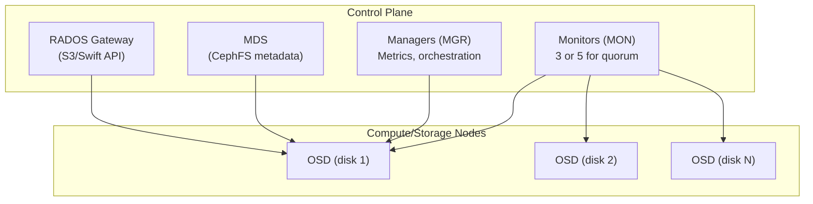

# Ceph

Ceph is the distributed storage engine at the foundation of CobaltCore's storage layer. It provides three storage interfaces — block (RBD), file (CephFS), and object (RGW) — from a single cluster, managed by [Rook](./rook) as a Kubernetes-native workload.

## How CobaltCore uses Ceph

| Interface | Used by |
|---|---|
| **RBD** (block) | Nova/Cinder VM disks, Glance image store |
| **CephFS** (file) | Shared filesystems for workloads requiring POSIX access |
| **RGW** (object) | S3/Swift-compatible object storage for applications |

## Cluster architecture

A Ceph cluster consists of several daemon types that work together:

| Daemon | Role |
|---|---|
| **MON** (Monitor) | Maintains cluster map and quorum; clients connect to MONs to locate data |
| **MGR** (Manager) | Exposes metrics, hosts the dashboard, and provides orchestration APIs |
| **OSD** (Object Storage Daemon) | Stores data on each disk; handles replication and recovery |
| **MDS** | Manages CephFS metadata; not required for RBD or RGW workloads |
| **RGW** | Provides S3 and Swift HTTP APIs backed by RADOS |

## Data placement: CRUSH

Ceph uses the CRUSH algorithm to determine where data is stored across OSDs — no central lookup table is needed. CRUSH maps data across failure domains (hosts, racks, data centers) according to a configurable hierarchy. In CobaltCore stretched deployments, CRUSH is configured to spread replicas across two physical sites with a third tiebreaker site managed by [Arbiter](./arbiter).

## Replication and erasure coding

CobaltCore uses **replication** (typically 3 copies) for most pools. Erasure coding is available for large object stores where storage efficiency matters more than write latency.

## See also

- [Storage — Rook](./rook) — Kubernetes operator that manages this Ceph cluster
- [Storage — Arbiter](./arbiter) — stretched cluster quorum
- [Ceph upstream architecture docs](https://docs.ceph.com/en/latest/architecture/)
