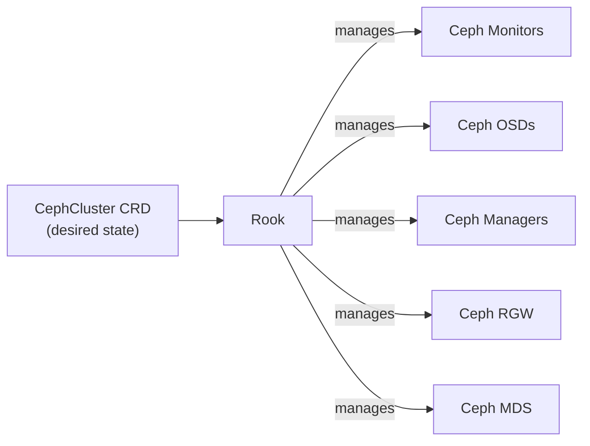

# Rook

::: tip Source Code
[github.com/rook/rook](https://github.com/rook/rook)
:::

Rook is an open-source cloud-native storage orchestrator that automates the
deployment, configuration, and management of [Ceph](./ceph.md) storage clusters
within Kubernetes environments. Built as a Kubernetes operator, Rook extends
Kubernetes with custom resource definitions (CRDs) that allow administrators to
define and manage Ceph clusters using native Kubernetes APIs and tools.

Rook eliminates much of the operational complexity traditionally associated
with running Ceph by leveraging Kubernetes primitives for scheduling,
self-healing, and scaling. When deployed, Rook runs as a set of pods within the
Kubernetes cluster, managing the lifecycle of Ceph daemons (monitors, managers,
OSDs, MDS, and RGW) as containerized workloads. It automatically handles tasks
such as OSD provisioning from available storage devices, the management of the
monitor quorum.

The system provides declarative configuration through YAML manifests, enabling
infrastructure-as-code practices for storage management. Administrators can
define storage classes that map to Ceph pools, allowing applications to
dynamically provision persistent volumes for block storage (RBD), shared file
systems (CephFS), or object storage (RGW) through standard Kubernetes
mechanisms.

Rook continuously monitors cluster health and automatically responds to
failures by restarting failed daemon pods and maintaining the desired state
defined in the cluster specifications. Replacing a failed storage device still
requires an administrator to prepare the replacement and remove the failed OSD.
It integrates with [Kubernetes](https://kubernetes.io/) monitoring and logging systems,
providing visibility into storage operations alongside application workloads.

## Why Rook?

Running Ceph as a Kubernetes workload means the cluster lifecycle - initial
deployment, scaling, upgrades, and self-healing - is handled by Kubernetes
controllers rather than manual playbooks. Rook bridges the gap between Ceph's
daemon model and Kubernetes' declarative model.

CobaltCore's cloud infrastructure and automation foundation are built on
Kubernetes. Rook is therefore used to manage Ceph workloads through the same
declarative control plane.

## How Rook manages Ceph

You describe the desired cluster state in a `CephCluster` CRD. Rook reconciles the running Ceph daemons to match that state:



## Installation

### Prerequisites

- Kubernetes 1.31 through 1.37
- Raw block devices available on storage nodes (unformatted, no filesystem)
- Network connectivity between storage nodes

The commands below pin Rook `v1.20.7` and Ceph `v20.2.4` so the chart,
manifests, and compatibility range remain consistent.

### Install the operator

```bash
helm repo add rook-release https://charts.rook.io/release
helm repo update

helm install --create-namespace \
  --namespace rook-ceph \
  --version v1.20.7 \
  --wait \
  rook-ceph rook-release/rook-ceph

helm repo add ceph-csi-operator https://ceph.github.io/ceph-csi-operator
helm repo update

helm install --namespace rook-ceph \
  --version 1.0.4 \
  --wait \
  -f https://raw.githubusercontent.com/rook/rook/v1.20.7/deploy/charts/ceph-csi-drivers/values.yaml \
  ceph-csi-drivers ceph-csi-operator/ceph-csi-drivers
```

The `rook-ceph` chart installs the Ceph-CSI operator and its CRDs. The second
chart installs the driver resources reconciled by that operator.

### Deploy the Ceph cluster

Create a `CephCluster` resource. A minimal 3-node cluster:

::: danger Dedicated devices only
The example sets `useAllDevices: true`. Rook will consume every eligible raw
device it discovers on the selected nodes. Use dedicated storage nodes, or set
this option to `false` and select devices explicitly before applying the
manifest.
:::

```yaml
apiVersion: ceph.rook.io/v1
kind: CephCluster
metadata:
  name: rook-ceph
  namespace: rook-ceph
spec:
  cephVersion:
    image: quay.io/ceph/ceph:v20.2.4
  dataDirHostPath: /var/lib/rook
  mon:
    count: 3
    allowMultiplePerNode: false
  mgr:
    count: 1
  storage:
    useAllNodes: true
    useAllDevices: true
```

Apply it and watch the cluster form:

```bash
kubectl apply -f ceph-cluster.yaml
kubectl get cephcluster -n rook-ceph -w
```

### Create storage classes

**RBD (block):**

```bash
kubectl apply -f https://raw.githubusercontent.com/rook/rook/v1.20.7/deploy/examples/csi/rbd/storageclass.yaml
```

**CephFS (file):**

```bash
kubectl apply -f https://raw.githubusercontent.com/rook/rook/v1.20.7/deploy/examples/filesystem.yaml
kubectl apply -f https://raw.githubusercontent.com/rook/rook/v1.20.7/deploy/examples/csi/cephfs/storageclass.yaml
```

### Verify

First install the Rook toolbox to get access to `ceph` CLI commands:

```bash
kubectl apply -f https://raw.githubusercontent.com/rook/rook/v1.20.7/deploy/examples/toolbox.yaml
kubectl rollout status deployment/rook-ceph-tools -n rook-ceph
```

Then check cluster health:

```bash
# Check cluster health
kubectl exec deployment/rook-ceph-tools -n rook-ceph -- ceph status

# List OSDs
kubectl exec deployment/rook-ceph-tools -n rook-ceph -- ceph osd tree
```

A healthy cluster reports `HEALTH_OK`.

## Troubleshooting

| Symptom | Common cause |
|---|---|
| Operator pod not starting | Missing RBAC or CRDs not installed |
| OSDs not starting | Disk already has a filesystem; must be raw |
| `HEALTH_WARN: too few PGs` | Pool PG count needs adjustment for cluster size |
| Monitors not forming quorum | Network partitioning between nodes |

For stretched-cluster quorum in multi-site deployments, see [Storage - Arbiter](./arbiter).

## See also

- [Storage - Ceph](./ceph)
- [Storage - Arbiter](./arbiter)
- [Rook documentation](https://rook.io/docs/rook/latest-release/Getting-Started/intro/)
